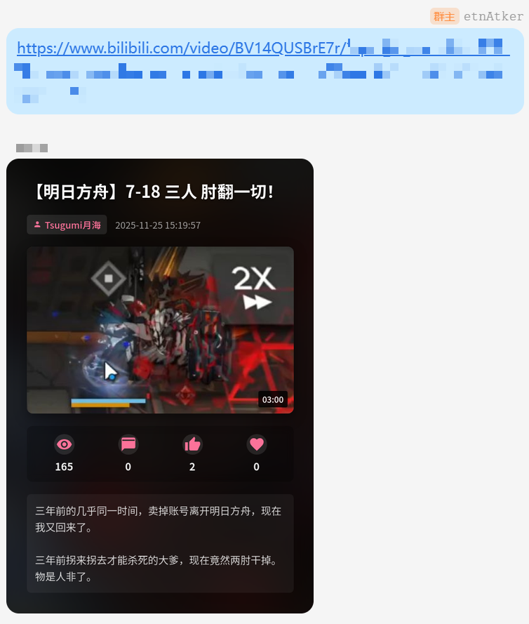

# koishi-plugin-bili-link-previewer

B 站视频信息预览插件：渲染预览图，不用点开也能知道视频内容。

## 预览

## 功能

- 自动识别消息中的 Bilibili 视频 BV 号
- 使用 Puppeteer 渲染精美的视频信息卡片
- 包含视频封面、标题、时长、UP 主、播放/弹幕/点赞/收藏数据、简介等信息

## 使用

只需在聊天中发送包含 BV 号的消息（如 `BV1xx...`），机器人将自动回复生成的图片。

## 配置项

| 配置项 | 类型 | 默认值 | 说明 |
| :--- | :--- | :--- | :--- |
| `antiRepeatTimeout` | `number` | `10` | 对于重复 BV 号的静默时长（秒）。用于防止多机器人环境下的回声或重复触发。 |
| `userAgent` | `string` | (自带 Chrome UA) | 请求 B 站 API 时使用的 User-Agent 字符串。 |
